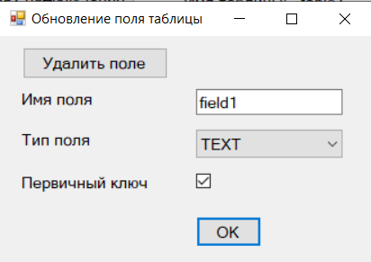

# Приложение для работы с базой данных

## О приложении

Приложение предназначено для взаимодействия с локальной базой данных Postgre. Позволяет создавать, редактировать, просматриватьи удалять таблицы и их поля в базе данных.

Приложение написано на C# с использованием платформы Windows Forms и СУБД PostgreSQL.

### Интерфейс приложения

*  Стартовое окно подключения к базе данных

 

*  Главное меню приложения

 

*  Окно обновления поля таблицы

 
